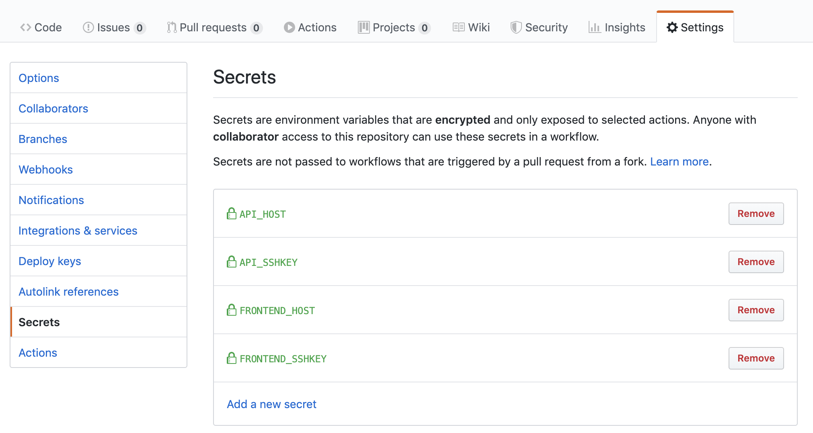
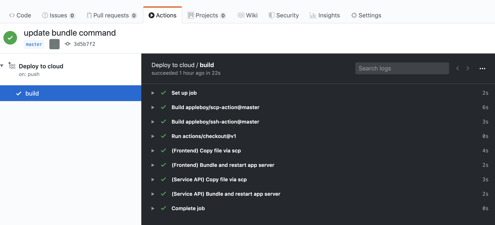

# Service API tutorial - CI/CD

It is cumbersome to have to ssh into your droplets to update your app every time. We want to be able to just push the code, and the app will be updated automagically.

## Prerequisites

- You must complete part 1 and 2 first

## Step 1 - Setup Github Actions file

We are going to use Github Actions to setup our continuous deployment pipeline.

What it does is to automate what we did before *with ssh, git clone etc...* with a simple pipeline file.

Create a file named `ci.yml` under directory `.github/workflows` in your repo.

`ci.yml`:

```yaml
name: Deploy to cloud

on: [push]

jobs:
  build:

    runs-on: ubuntu-latest

    steps:
    - uses: actions/checkout@v1

    - name: (Frontend) Copy file via scp
      uses: appleboy/scp-action@master
      env:
        HOST: ${{ secrets.FRONTEND_HOST }}
        USERNAME: root
        PORT: 22
        KEY: ${{ secrets.FRONTEND_SSHKEY }}
      with:
        source: "."
        target: "/home/rails/service-api-example"

    - name: (Frontend) Bundle and restart app server
      uses: appleboy/ssh-action@master
      with:
        host: ${{ secrets.FRONTEND_HOST }}
        USERNAME: root
        PORT: 22
        KEY: ${{ secrets.FRONTEND_SSHKEY }}
        script: |
          su - rails -c "cd /home/rails/service-api-example/frontend-sinatra && bundle"
          sudo systemctl restart rails.service
    - name: (Service API) Copy file via scp
      uses: appleboy/scp-action@master
      env:
        HOST: ${{ secrets.API_HOST }}
        USERNAME: root
        PORT: 22
        KEY: ${{ secrets.API_SSHKEY }}
      with:
        source: "."
        target: "/home/rails/service-api-example"

    - name: (Service API) Bundle and restart app server
      uses: appleboy/ssh-action@master
      with:
        host: ${{ secrets.API_HOST }}
        USERNAME: root
        PORT: 22
        KEY: ${{ secrets.API_SSHKEY }}
        script: |
          su - rails -c "cd /home/rails/service-api-example/service-api-sinatra && bundle"
          sudo systemctl restart rails.service
```

## Step 2 - Setup secrets

This pipeline needs to have access to your droplets in order to update them.

Go to `Settings` -> `Secrets` and add the following keys:

- `FRONTEND_HOST`
  - The public v4 ip of `frontend-sinatra` droplet
- `FRONTEND_SSHKEY`
  - The private key `.ssh/id_rsa` of `frontend-sinatra` droplet
- `API_HOST`
  - The public v4 ip of `service-api-sinatra` droplet
- `API_SSHKEY`
  - The private key `.ssh/id_rsa` of `service-api-sinatra` droplet



If you don't have the private key in your sever, you need to generate them and add the public key to `authorized_keys`.

1. `ssh-keygen`
2. `cd .ssh`
3. `echo "$(cat id_rsa.pub)" >> authorized_keys`
4. To show the content of your private key `cat id_rsa` <- copy this to the corresponding `*_SSHKEY`

## Step 3 - Trigger the pipeline

Now you have the Secrets all set up, you need to push your code to trigger the pipeline.

```bash
git add .github/workflows/ci.yml
git commit -m "Add autodeploy pipeline"
git push
```

You should see the pipeline running under `Actions`



Once it finish you should be able to see the updated site at http://frontend-sinatra/

**To see the logs of any of your apps**

```bash
doctl compute ssh service-api-sinatra --ssh-command "journalctl -u rails.service -e -f"
```

### **Congrats! You now have a auto-deploying pipeline!** 🎉
