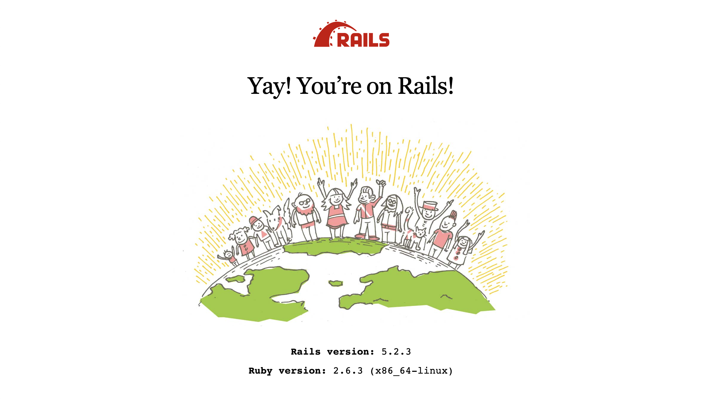
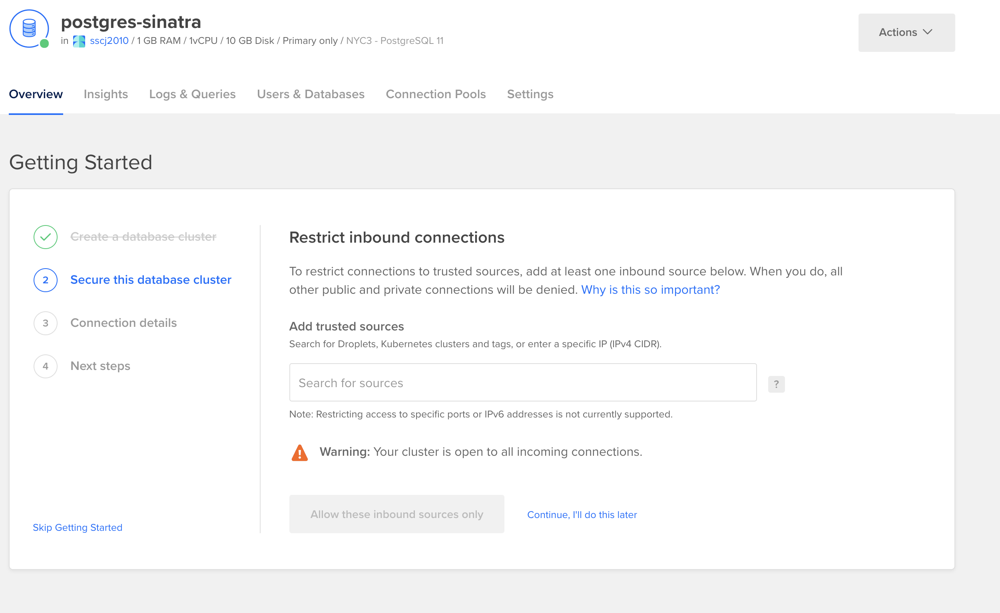
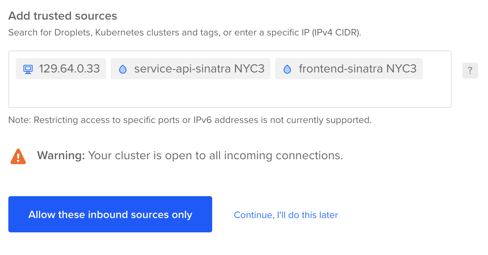

# Service API tutorial - Cloud

## Prerequisites

- DigitalOcean account
  - Signup and get an API key: https://cloud.digitalocean.com/account/api/ -> "Generate New Token"
- SSH key on DigitalOcean
  - Go on: https://cloud.digitalocean.com/account/security and add your "SSH Key" following the instructions on the site, **and write down your "fingerprint"**
- DO command line tool `doctl`
  - Install: https://github.com/digitalocean/doctl#installing-doctl

## Step 1 - Create Resources on DigitalOcean

To create a droplet for Frontend named: "frontend-sinatra"

*Replace `$fingerprint` below with your "fingerprint"*

```bash
doctl compute droplet create frontend-sinatra --size s-1vcpu-1gb --image rails-18-04 --region nyc3 --ssh-keys $fingerprint --enable-private-networking
```

You should see something like this:

```bash
ID           Name                Public IPv4    Private IPv4    Public IPv6    Memory    VCPUs    Disk    Region    Image                       Status    Tags    Features    Volumes
178741332    frontend-sinatra                                                  1024      1        25      nyc3      Ubuntu 18.04.3 (LTS) x64    new
```

Do the same for the Service API droplet:

```bash
doctl compute droplet create service-api-sinatra --size s-1vcpu-1gb --image rails-18-04 --region nyc3 --ssh-keys $fingerprint --enable-private-networking
```

Now you should have 2 droplets created:

```bash
> doctl compute droplet list
ID           Name                   Public IPv4        Private IPv4      Public IPv6    Memory    VCPUs    Disk    Region    Image                       Status    Tags    Features              Volumes
178741332    frontend-sinatra       165.227.117.206    10.132.199.188                   1024      1        25      nyc3      Ubuntu 18.04.3 (LTS) x64    active            private_networking
178741737    service-api-sinatra    138.197.75.224     10.132.17.75                     1024      1        25      nyc3      Ubuntu 18.04.3 (LTS) x64    new               private_networking
```

Go on your droplet's public IP with your browser, you should see something like this:



## Step 2 - Setup database on DigitalOcean

Now you need a Postgres database:

```bash
doctl database create postgres-sinatra --engine pg --region nyc3 --size db-s-1vcpu-1gb --version 11 --num-nodes 1
```

**This step might takes a while to run...*

You should see something like this:

```bash
ID                                      Name                      Engine    Version    Number of Nodes    Region    Status      Size
bd0e7e9f-01ba-40cf-a48f-defbdde78560    postgres-sinatra          pg        11         1                  nyc3      creating    db-s-1vcpu-1gb
```

Create a "postgres" database, this will be useful for `db:migrate` later on in the tutorial

*Replace `$ID` with the database ID you got above*

```bash
doctl database db create $ID postgres
```

## Step 3 - Setup the connections between your droplets and database

Go on https://cloud.digitalocean.com/databases and click on the database you just created ("postgres-sinatra")



Click on "Add trusted sources" and select the two droplets, plus your laptop's ip.



Then click "Allow these inbound sources only".

Now you should be able to access your database from your droplets and your laptop!

## Step 4 - Connect to database from your laptop

Click "Connection details" then "Flags" to see the commands for connecting using `psql`


Run that command in terminal and you should be able to connect to the database.

### **Now your cloud architecture is all ready to go!** 🎉

### Go to [Part 2](sinatra.md)
